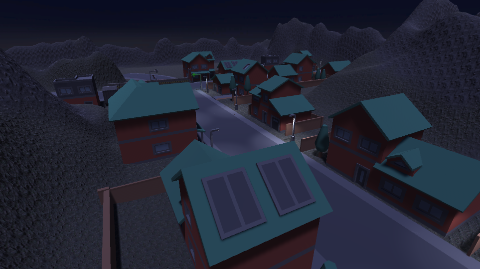
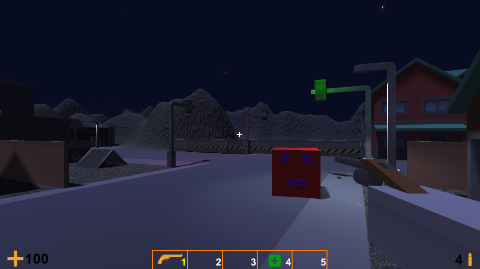
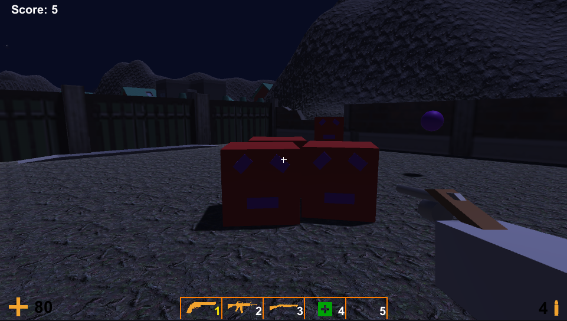
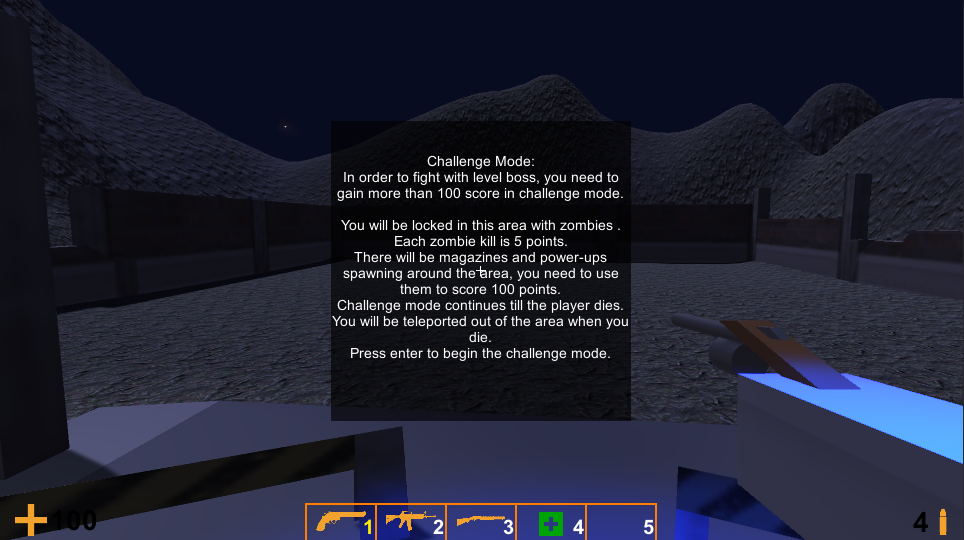
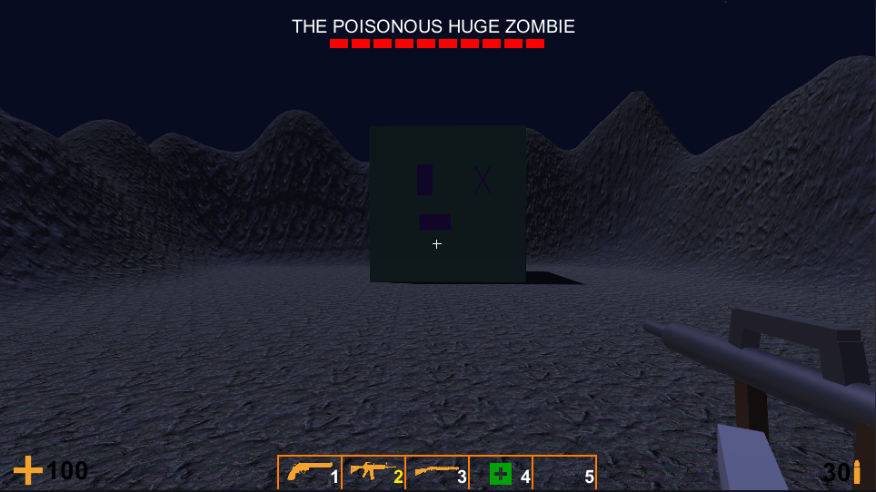

# ZomCube

ZomCube is a first-person shooter game set in a small town infested with hordes of cube zombies. Your mission is to survive the zombie attacks, score enough points in the challenge area, and defeat the powerful boss. Arm yourself with various weapons, find ammunition and healthkits, and try to survive.

## Key Features

- Fun first-person shooter action against relentless waves of zombies.
- Explore a detailed and immersive small town environment, filled with abandoned buildings, and atmospheric lighting.
- Three types of items to collect:
  - Weapons: Pistol, automatic rifle, and shotgun, each with unique strengths and weaknesses.
  - Magazines: Provides ammunition for your current weapon.
  - Healthkits: Restores your health.
- Challenge area: Engage in a difficult fight against continuously spawning zombies. Collect for power-ups that provide temporary boosts in damage, speed, and health.
- Boss battle: Defeat the formidable boss with two unique abilities - a powerful dash attack and poisonous slime balls. Avoid the poison before it stacks too high.
- Progressive difficulty: Each time you defeat the boss, the game becomes harder. Zombies gain more health and deal more damage, while the boss becomes faster and gains more health.
- Action bar and UI: The action bar at the bottom allows you to switch between weapons and healthkits quickly. The UI displays your health and current ammo, keeping you informed and prepared for battle.

## Play
- You can play the game [using this link](https://berkeparildar.itch.io/zomcube).
## Screenshots

- 
- 
- 
- 

